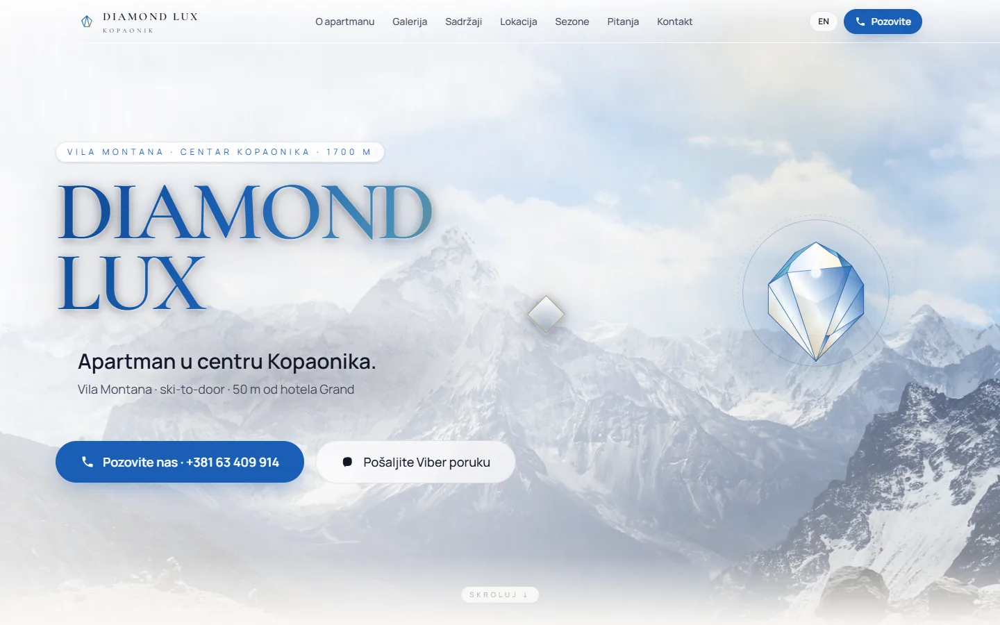
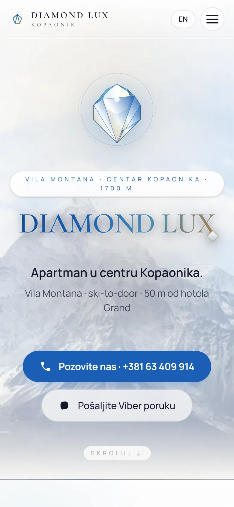
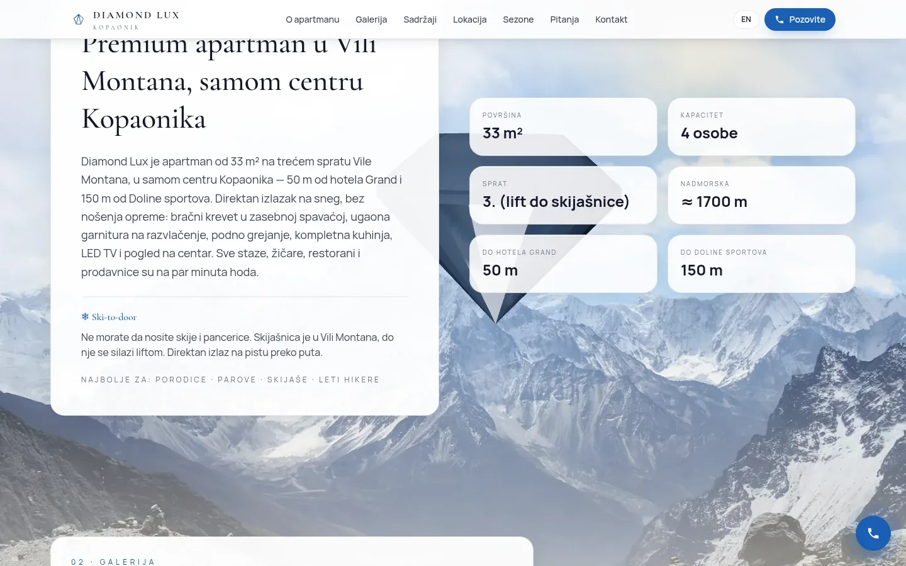
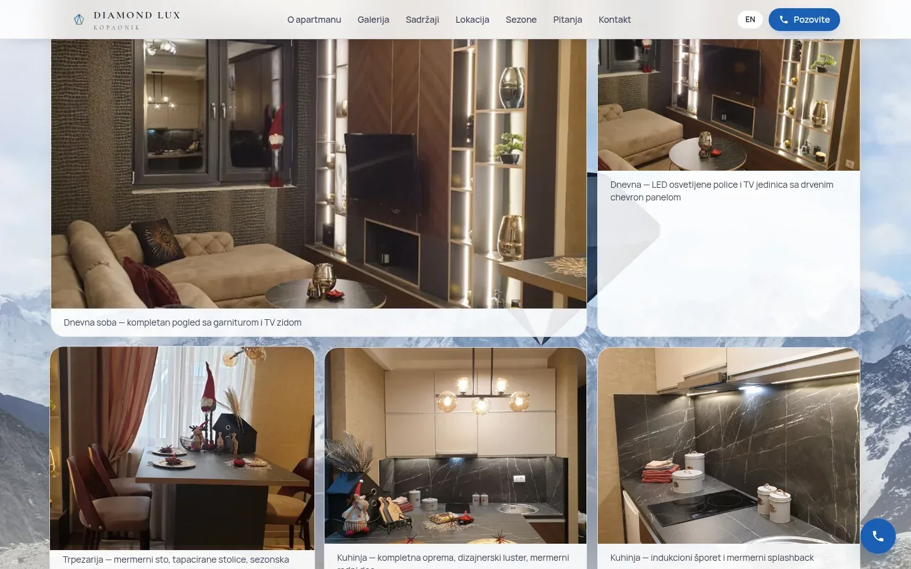

# Diamond Lux Kopaonik

One-page site in Serbian and English for a ski-to-door apartment in the centre of Kopaonik, with a WebGL diamond that follows the scroll.

**[diamondlux.svilenkovic.rs](https://diamondlux.svilenkovic.rs/)** · [Case study (in Serbian)](https://svilenkovic.com/radovi/diamond-lux-kopaonik) · [Srpski](README.sr.md)

> [!NOTE]
> Client project. The source code belongs to the client and stays in a private repository. This page describes what I built and how.

<table>
  <tr><td><b>Client</b></td><td>Diamond Lux</td></tr>
  <tr><td><b>Industry</b></td><td>Holiday apartment rental</td></tr>
  <tr><td><b>Location</b></td><td>Kopaonik, Serbia</td></tr>
  <tr><td><b>Type</b></td><td>One-page bilingual website</td></tr>
  <tr><td><b>My role</b></td><td>Design, development, SEO, hosting and maintenance</td></tr>
  <tr><td><b>Stack</b></td><td>Next.js 15, React Three Fiber, next-intl, Tailwind 4, Lenis</td></tr>
</table>

## About the project

Diamond Lux is a 33 m² apartment for four in Vila Montana, in the centre of Kopaonik, 50 m from Hotel Grand, with a ski room in the building and the slope across the road. It had lived on booking portals and Instagram, and the owner wanted a place of its own that convinces a guest quickly and ends in a phone call rather than a form. Everything that decides a booking had to fit into one scroll, in Serbian and English.

The apartment's name gave the idea: a diamond rendered in WebGL floats behind the content and moves as you scroll. The stone is a brilliant cut written in code, with a refractive index of 2.42, and its geometry is kept non-indexed, so every facet has its own normals and looks flat and sharp. A clear stone on the site's warm, light background simply vanished, so a dark disc sits behind it for contrast and fades out as you scroll down.

## What I built

- Seven sections with anchor navigation: apartment, gallery, amenities, location, seasons, FAQ and contact
- Booking only by phone or a Viber message that opens with the first line already written, plus a floating call button
- The 3D library in its own bundle, loaded only after WebGL is confirmed, with an error boundary that falls back to a mountain photo
- Scene lighting set up in code, with no environment map fetched from another server
- Serbian strings left in components moved into translation files, checked by searching the English HTML for Serbian letters
- An OpenStreetMap embed in place of a Google map that the security policy had been silently blocking

## Results

| | Performance | Accessibility | Best practices | SEO |
| :-- | :-: | :-: | :-: | :-: |
| Mobile | 93 | 100 | 100 | 100 |
| Desktop | 99 | 100 | 100 | 100 |

PageSpeed Insights, lab test of the live site, September 2026. Security headers: 6 of 6. HTML validator: no errors. axe accessibility check: no violations. Structured data: `Apartment`, `BreadcrumbList`, `FAQPage`, `LodgingBusiness`.

## Screenshots

<table>
  <tr>
    <td width="68%" valign="top"></td>
    <td width="32%" valign="top"></td>
  </tr>
</table>

About the apartment: a premium apartment in Vila Montana and what ski-to-door means

Gallery: living room, dining room and kitchen, each photo with its own caption

---

Built by [D. Svilenković](https://svilenkovic.com).
